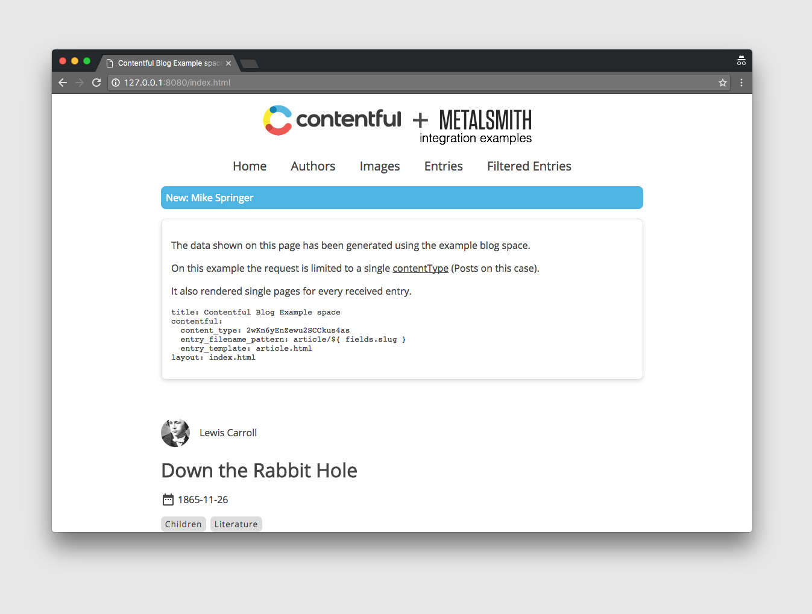

# contentful-metalsmith-example

An example to showcase the integration of [Metalsmith](http://www.metalsmith.io/) and [Contentful](www.contentful.com) by using a metalsmith plugin: [contentful-metalsmith](https://github.com/contentful/contentful-metalsmith).

# About

The goal of this project is to show how easily you can create static sites using the content (text, images, links, etc.) stored on [Contentful](http://www.contentful.com). This project
is configured to fetch data from a public [space](https://www.contentful.com/developers/documentation/content-delivery-api/http/#spaces) using [Contentful's Content Delivery API](https://www.contentful.com/developers/documentation/content-delivery-api/http/#spaces).



The result is a blog site including several posts and authors.

# Usage

1. Clone and install the project dependencies

  ```shell
    $ git clone git@github.com:contentful/contentful-metalsmith-example.git
    $ cd contentful-metalsmith-example
    $ npm install
  ```

2. Run metalsmith

  ```shell
    # for building once
    $ npm start

    # for development and constant building
    $ npm run watch
  ```

After running metalsmith you will have several files into the ```build``` dir. Each of this files demonstrate a capability of the [contentful-metalsmith plugin](https://github.com/contentful/contentful-metalsmith):

  * ```authors.html```, shows only entries with [contentType](https://www.contentful.com/developers/documentation/content-delivery-api/http/#content-types) 'author'
  * ```index.html```, shows a list of entries with [contentType](https://www.contentful.com/developers/documentation/content-delivery-api/http/#content-types) 'article'.
  * ```images.html```, shows a list of entries with [contentType](https://www.contentful.com/developers/documentation/content-delivery-api/http/#content-types) 'image' but for a completely different space, which can become handy when you use several spaces.
  * ```filtered.html```, shows a list of [entries](https://www.contentful.com/developers/documentation/content-delivery-api/http/#entries) filtered by keyword 'rabbit'
  * ```article/*.html```, shows only entries with [contentType](https://www.contentful.com/developers/documentation/content-delivery-api/http/#content-types) 'album'.

For more info on the capabalities of the plugin visit [its repo](https://github.com/contentful/contentful-metalsmith).

